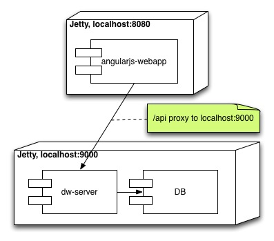

# General info

This is a little example application that I have used to learn to use the AngularJS and Dropwizard
frameworks. It also serves as a project template that can be used to get a new project up and running
quickly. A blog article describing what I did can be found here:
[Getting Started With AngularJS, Jetty and Dropwizard](http://perspilling.heroku.com/blog/2013/08/21/getting-started-with-angularjs-jetty-and-dropwizard/)

# Architecture information

AngularJS is used to create a simple webapp (angularjs-webapp module), while Dropwizard has
been used to create a backend server with RESTful services (dw-server module). The two are deployed on different
web servers, as shown here:

# Topics that have been explored

## AngularJS
- organizing an AngularJS webapp in modules and partials
- AngularJS directives, filters, calling backend services via $resource, etc.
- using Bootstrap with AngularJS
- using $promise returned from $resource calls to ensure that certains functions are executed in sequence

## Jetty
- using Jetty for both the webapp and the backend services
- embedding Jetty in the application in dw-server so that it is very easy to run and debug from the IDE.
- configuring Jetty in the angular-webapp as a proxy to the dw-server in order to tackle the issue that
  a JavaScript application is not allowed to call back to another server than it's origination server.

## Dropwizard
- creating RESTful (JSON) services with Jersey & Jackson, including health checks
- getting the services to handle requests from AngularJS $resource
- creating persistence logic with JDBI

## Maven
- using the the [appassembler-maven-plugin](http://mojo.codehaus.org/appassembler/appassembler-maven-plugin/index.html)
to generate a script that will set the classpath and run the webapp
- building fat JARS with [Maven Shade Plugin](http://maven.apache.org/plugins/maven-shade-plugin/) making it
possible to deploy Dropwizard services as single .jar files.

## [Gradle](http://www.gradle.org)
- For those with allergies towards xml bloat, there is a gradle (almost) equivalent build.

### Running the app with gradle
1. Start the dwServer `$projectRoot:> ./gradlew runDwServer`
2. Start the webApp `$projectRoot:> ./gradlew jettyMrun`

First time you run ./gradlew it will download a gradle distribution, not install neeeded.

